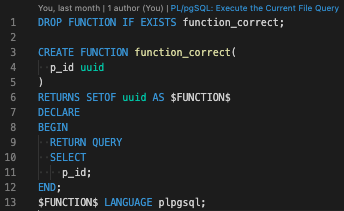

# PL/pgSQL Language Server

[](https://marketplace.visualstudio.com/items?itemName=uniquevision.vscode-plpgsql-lsp)
[](https://github.com/Naereen/StrapDown.js/blob/master/LICENSE)

## Features

- complete definitions.
- go to definition.
- go to document/workspace symbols.
- hover the definition.
- check syntax errors.
- check static analysis errors (when [plpgsql_check](https://github.com/okbob/plpgsql_check) use) .
- execute the current file query by CodeLens/Command.
- support [Multi-root Workspace](https://code.visualstudio.com/docs/editor/multi-root-workspaces).

| | Completion | Go to definition | Hover |
| :--- | :---: | :---: | :---: |
| DOMAIN                    | ✔️ | ✔️ | ✔️ |
| FUNCTION                  | ✔️ | ✔️ | ✔️ |
| INDEX                     | - | ✔️ | ✔️ |
| MATERIALIZED VIEW         | ✔️ | ✔️ | ✔️ |
| PROCEDURE                 | ✔️ | ✔️ | ✔️ |
| TABLE                     | ✔️ | ✔️ | ✔️ |
| TRIGGER                   | - | ✔️ | ✔️ |
| TYPE                      | ✔️ | ✔️ | ✔️ |
| VIEW                      | ✔️ | ✔️ | ✔️ |

<!-- UnSupported Features

See https://www.postgresql.org/docs/current/sql-commands.html

| | Completion | Go to definition | Hover |
| :--- | :---: | :---: | :---: |
| ACCESS METHOD             | - | - | - |
| AGGREGATE                 | - | - | - |
| CAST                      | - | - | - |
| COLLATION                 | - | - | - |
| CONVERSION                | - | - | - |
| DATABASE                  | - | - | - |
| EVENT TRIGGER             | - | - | - |
| EXTENSION                 | - | - | - |
| FOREIGN DATA WRAPPER      | - | - | - |
| FOREIGN TABLE             | - | - | - |
| GROUP                     | - | - | - |
| LANGUAGE                  | - | - | - |
| OPERATOR                  | - | - | - |
| OPERATOR CLASS            | - | - | - |
| OPERATOR FAMILY           | - | - | - |
| POLICY                    | - | - | - |
| PUBLICATION               | - | - | - |
| ROLE                      | - | - | - |
| RULE                      | - | - | - |
| SCHEMA                    | - | - | - |
| SEQUENCE                  | - | - | - |
| SERVER                    | - | - | - |
| STATISTICS                | - | - | - |
| SUBSCRIPTION              | - | - | - |
| TABLE AS                  | - | - | - |
| TABLESPACE                | - | - | - |
| TEXT SEARCH CONFIGURATION | - | - | - |
| TEXT SEARCH DICTIONARY    | - | - | - |
| TEXT SEARCH PARSER        | - | - | - |
| TEXT SEARCH TEMPLATE      | - | - | - |
| TRANSFORM                 | - | - | - |
| USER                      | - | - | - |
| USER MAPPING              | - | - | - |
-->

## Usage

1. Set your database connection to VSCode settings.
1. Open `.pgsql` file and edit your code!


## VSCode Settings Sample

```jsonc
{
  "plpgsqlLanguageServer.database": "your_database_name",
  "plpgsqlLanguageServer.user": "your_database_user",
  "plpgsqlLanguageServer.password": "your_database_password",
  "plpgsqlLanguageServer.definitionFiles": [
    // Support glob.
    "**/*.sql",
    "**/*.psql",
    "**/*.pgsql"
  ],
  // The supported extention types are ['*.pgsql', '*.psql'].
  // If you want to use this extension in '*.sql', add the following settings.
  "files.associations": {
    "*.sql": "postgres"
  }
}
```

## Disable Specific File
If you want to disable the extension for a specific file, just add this comment your file top.

```sql
/* plpgsql-language-server:disable */
```

Or, if you want to disable only the validation feature, try this

```sql
/* plpgsql-language-server:disable validation */
```

## Execute the Current File Query
You can execute the current file query from VSCode Command


Also, you can use it by CodeLens when your file is valid.




If you want to disable this feature, try this

```jsonc 
{
  "plpgsqlLanguageServer.enableExecuteFileQueryCommand": false
}
```

Shortcuts are not supported by default, 
but can be configured by adding the following setting to "keybindings.json".

```jsonc
[
  {
    "key": "f5",
    "command": "plpgsql-lsp.executeFileQuery",
    "when": "editorLangId == 'postgres'"
  }
]
```

## Workspace validation
If you want to validate the workspace files in the background,
please set the settings like this,

```jsonc
{
  "plpgsqlLanguageServer.workspaceValidationTargetFiles": [
    "definitions/**/*.pgsql",
    // "setup/**/*.pgsql"
  ]
}
```

Validation is executed under the following conditions.

- Start Language Server.
- "Execute the Current File Query" command was successfull.
- Execute "Validate the Workspace Files" command.

## Query Parameters
In the case of a file that defines a query with parameters,
You can validate it by adding the query parameter comment at the file top.

```sql
/* plpgsql-language-server:use-query-parameter */

SELECT
  id,
  name
FROM
  users
WHERE
  id = $1 AND name = ANY($2);
```

If you want to use keyword query parameter,
need to set the parameter pattern in the settings file.

```jsonc
{
  "plpgsqlLanguageServer.queryParameterPattern": ":[A-Za-z_][A-Za-z0-9_]*"
}
```

```sql
/* plpgsql-language-server:use-query-parameter */

SELECT
  id,
  name
FROM
  users
WHERE
  id = :id AND name = ANY(:names);
```


### Positional Query Parameters
To more explicitly indicate that it is a positional parameter,
the following comment can be given.

```sql
/* plpgsql-language-server:use-positional-query-parameter */

SELECT
  id,
  name
FROM
  users
WHERE
  id = $1 AND name = ANY($2);
```

This tool counts the number of parameters with a simple regular expression,
so complex queries file require the number to be specified explicitly in the comment.

```sql
/* plpgsql-language-server:use-positional-query-parameter number=2 */

SELECT
  id,
  name,
  'This text contains "$3" :('
FROM
  users
WHERE
  id = $1 AND name = ANY($2);
```

### Keyword Query Parameters
Support query with keyword parameters, same as positional parameters.

However, the format of the keyword parameter varies from library to library,
so must be indicated in the settings file.

```jsonc
{
  "plpgsqlLanguageServer.keywordQueryParameterPattern": ["@{keyword}"]
}
```

You have finished setting, you can validate it like this.

```sql
-- plpgsql-language-server:use-keyword-query-parameter

SELECT
  id,
  name
FROM
  users
WHERE
  id = @id AND name = ANY(@names);
```

The complex queries file require the keywords to be specified explicitly in the comment.

```sql
-- plpgsql-language-server:use-keyword-query-parameter keywords=[id, names]

SELECT
  id,
  name,
  'This text contains "@tags" :('
FROM
  users
WHERE
  id = @id AND name = ANY(@names);
```

## Multiple Statements
If you want to validate multiple statements individually, you can do so by giving the following settings.

```jsonc
{
  "plpgsqlLanguageServer.keywordQueryParameterPattern": [
    "@{keyword}",
    "sqlc\\.arg\\s*\\('{keyword}'\\)",
    "sqlc\\.narg\\s*\\('{keyword}'\\)",
  ],
  "plpgsqlLanguageServer.statementSeparatorPattern": "-- name:[\\s]+.*",
}
```

This setting allows the following files to be handled.

```sql
-- plpgsql-language-server:use-keyword-query-parameter

-- name: ListUser :many
SELECT
  id,
  name
FROM
  users
WHERE
  id = sqlc.arg('id');

-- name: ListUsers :many
SELECT
  id,
  name
FROM
  users
WHERE
  name = ANY(@names);
```
